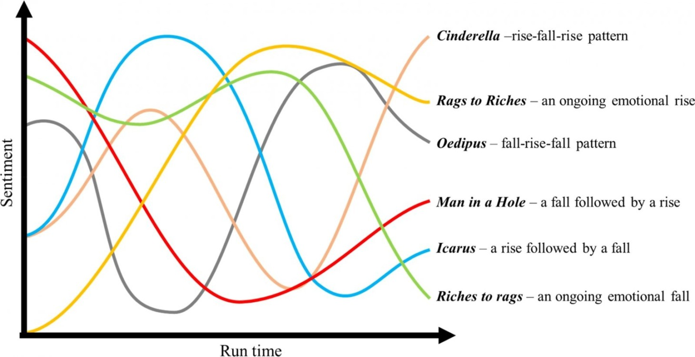
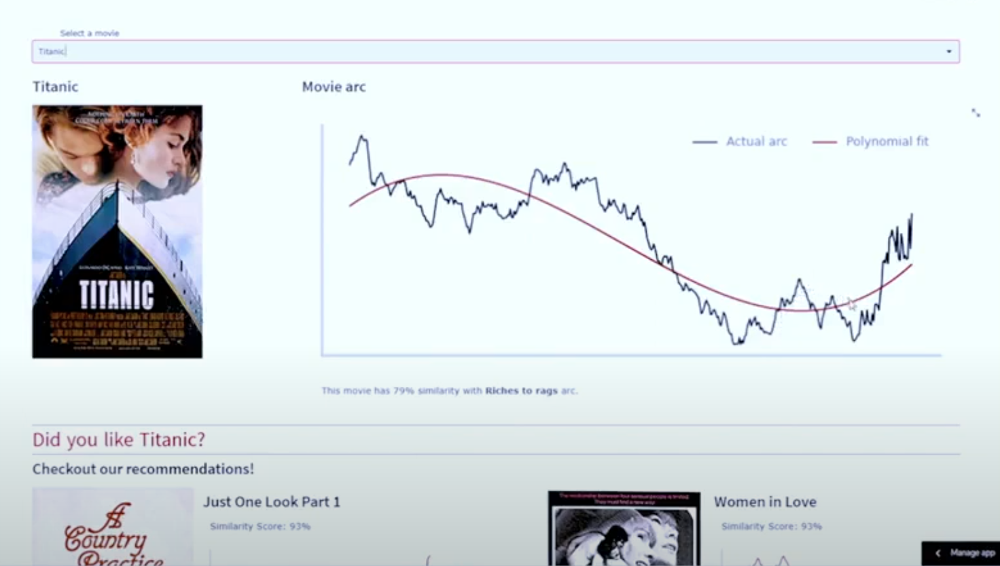

# 🎬 Movie Script Sentiment Analysis App

Welcome to the **Movie Script Sentiment Analysis App**! This interactive web application, built with **Streamlit**, analyzes the sentiment of movie scripts and visualizes emotional trends over time.  

## 📚 Context

In his anthropology master’s thesis, Kurt Vonnegut proposed the idea of mapping story shapes along an axis of good and bad fortune. He suggested that most narratives follow similar arcs—and that these simple patterns could be analyzed by computers.

In 2016, researchers from the University of Vermont and the University of Adelaide tested this theory by analyzing over two thousand books, uncovering six core story shapes.

This project aims to explore whether those same narrative patterns emerge in movies.

  

## 🚀 Features

- 🎞️ **Script Sentiment Analysis:** Analyze the emotional journey of a movie by processing its script.  
- 📈 **Emotional Arc Visualization:** Plot sentiment scores over time, highlighting emotional highs and lows throughout the film.  
- 🎨 **Recommendation Engine:** Visualize suggested movies based on both traditional metadata and their unique emotional arcs, offering deeper, sentiment-driven recommendations.  

## 🔍 Demo Preview

  
*Visual representation of sentiment shifts across a movie’s timeline.*

## ⚙️ How It Works

1. Select a movie script.  
2. The model processes the script using **Natural Language Processing (NLP)** techniques to analyze sentiment.  
3. Visualize the emotional progression of the film with an intuitive sentiment-over-time graph.  

## 💡 Technologies Used

- **Python**  
- **Streamlit**  
- **VADER for sentiment analysis**  
- **Kmeans for clustering**
- **Cosine similarity for recommendation** 
- **Matplotlib** and **Seaborn** for data visualization  

## 🏁 Getting Started

### Prerequisites
Make sure you have Python 3.8+ installed. Install the required packages using pip:

```bash
pip install -r requirements.txt
